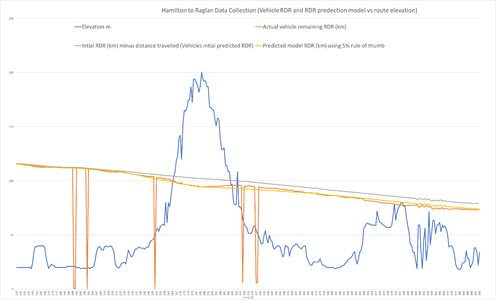

# EV_SOC-ELEVATION_PUBLIC_DATASET
## EVTP Project Data Collection
This repository was created in support of the EVTP project, where it represents real time electric vehicle (EV) battery and route elvation information. Real time EV battery SOC and route elevation have been collected from a Nissan Leaf from a trip from Hamilton to Raglan. 

All information has been collected using the developed data logging application and this data represents the raw data collected. This data set puts battery SOC information along with route elevation information such that, the EVs battery consumption with differing levels of inclince or increases in elevation can be evaulated. 

This dataset shows the impact that route elevation has on EV battery SOC. It is freely available to use and can be used in attempt to model this impact. The following graph was created from the dataset which highlights the impact that route terrian has on EVs RDR where the yellow line represents an estimation model created in the EVTP project.  

